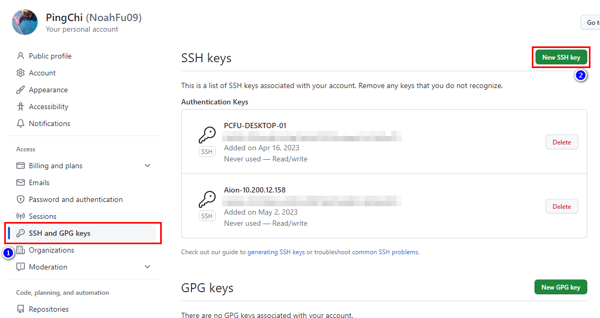
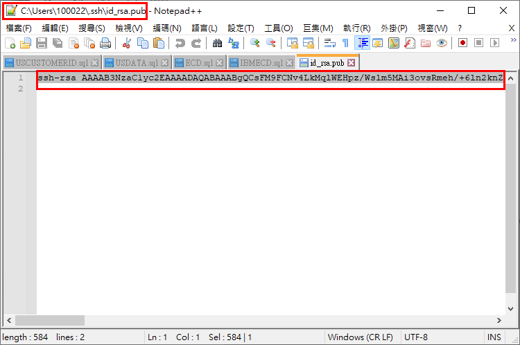
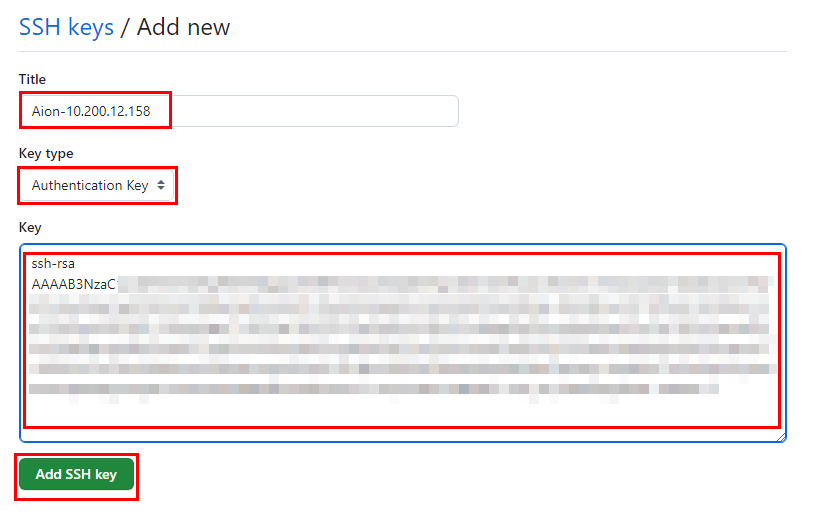

# 建立本機 SSH 金鑰

## 概要 (summary)

為了不用每次使用 VS Code Github 功能都要登入，因此可先建立 ssh 憑證，之後就一勞永逸

## 實戰演練 (practice)

1.首先輸入指令來產生 key

```bash
ssh-keygen
```

2.接著會詢問產生的 ssh key 要存放的位置，這時選擇要放的位置 預設為 /home/username/.ssh/id_rsa

```bash
(若用預設位置，直接鍵入Enter)
```

3.接著會詢問要不要設定 passphrase，空白表示不設定，如果有設定 passphrase，則每次用此 key 登入都需要輸入這個密碼 (安全性較高，可依個人需求設定)

```bash
(若用預設位置，直接鍵入Enter)
```

4.登入 github 並進入 settings



5.到 User 資料夾底下開啟 ssh 公鑰並複製



6.回 github 替公鑰命名(通常會命名使用電腦名稱)與貼上複製公鑰


