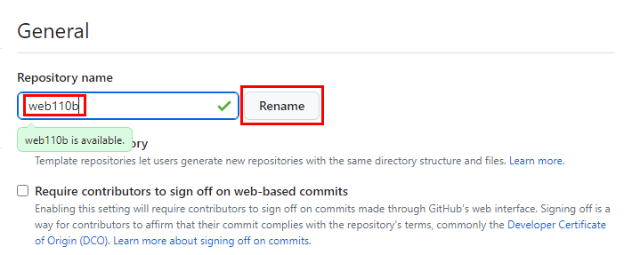
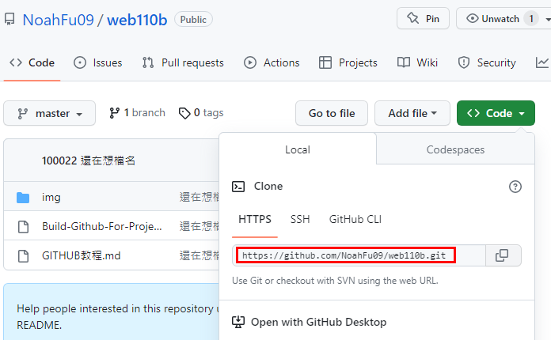

# 如何修改 GitHub 上已存在之 Repo 名稱

## 實戰演練

1.修改遠端 Repository 名稱

文件:`https://github.com/github 帳號/repo 名稱/settings`

範例:`https://github.com/NoahFu09/web110a/settings`



由 web110a 改成 web110b 輸入完後會自動檢核，綠色表示通過

2.複製新的 Repository 網址



3.切換到本地端資料夾，打開終端機輸入指令

```bash
git remote set-url origin https://github.com/NoahFu09/web110b.git
```

4.確認遠端伺服器網址

```bash
git remote -v
```
